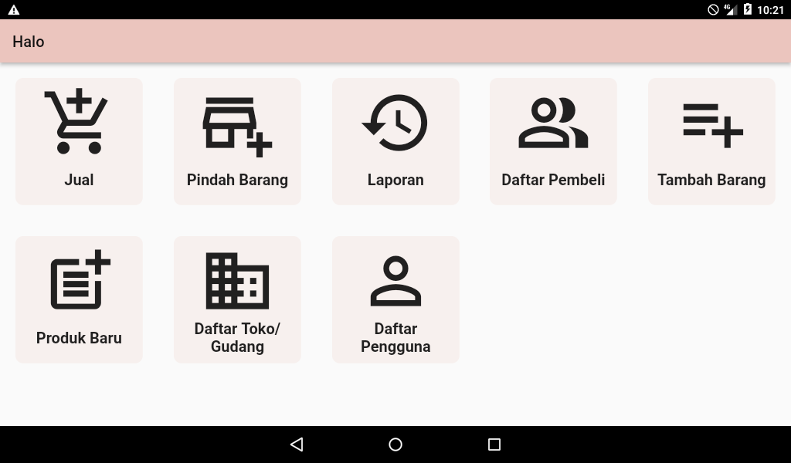
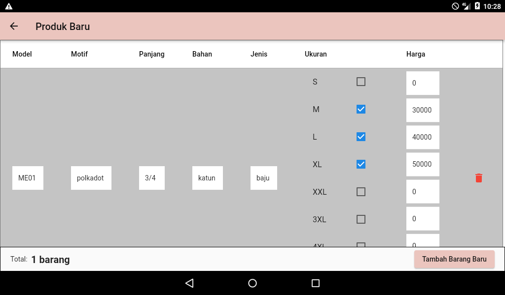
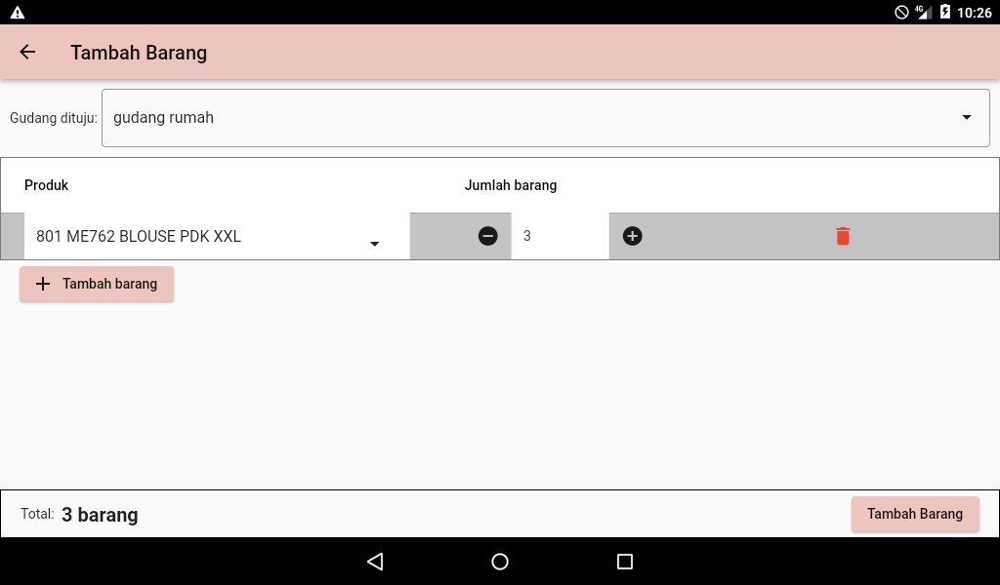
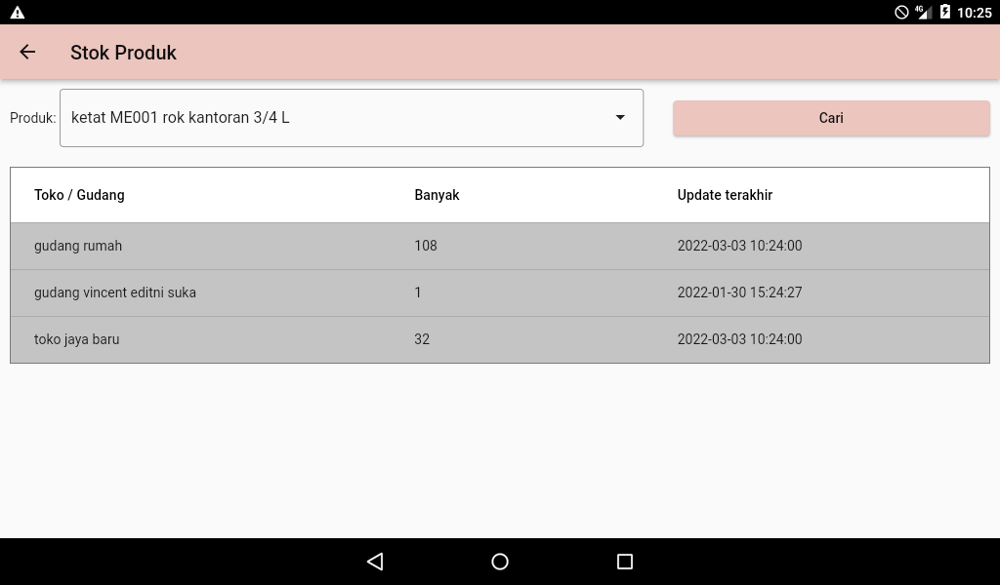
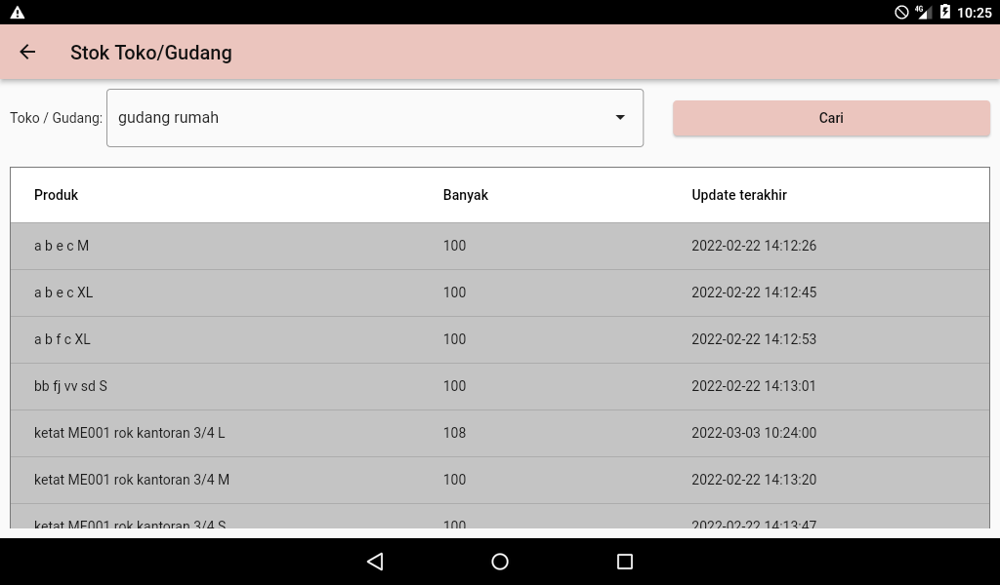
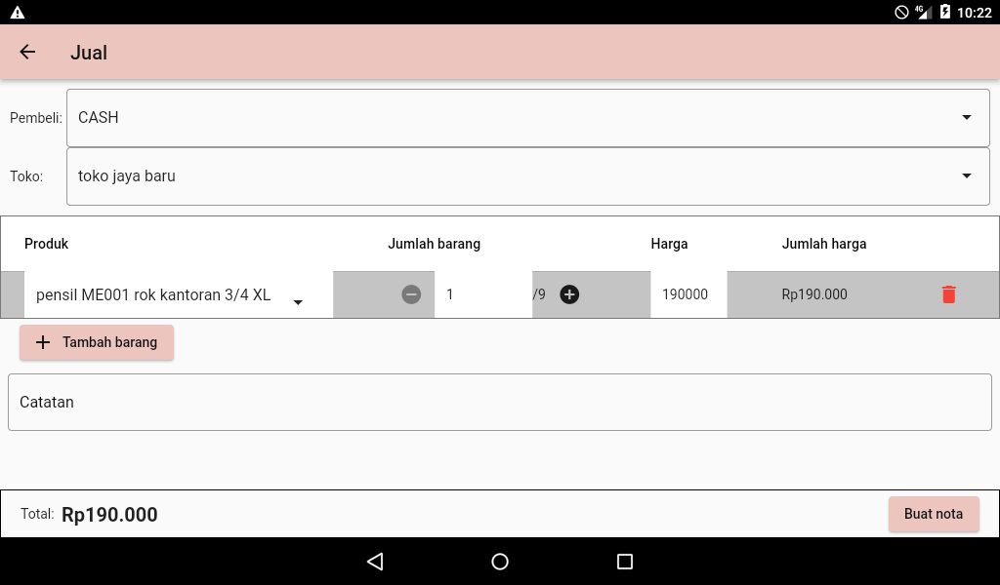
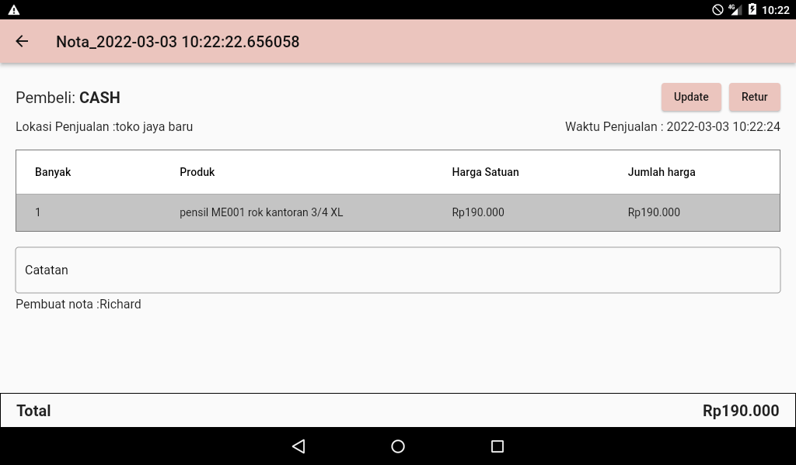
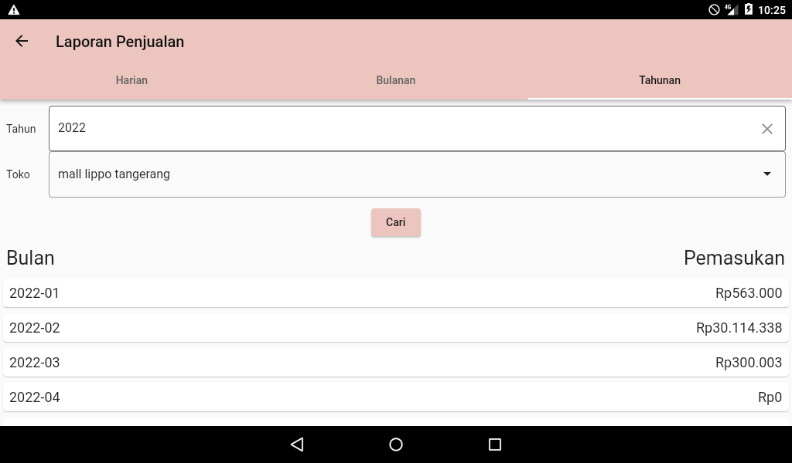

## Point Of Sales (POS) Application based on Node.js and Flutter

A few months ago, I and my friend created apps for stock inventory and record purchases. The client needed mobile apps to be used by the cashier, and stockkeeper in the store and warehouse. For the division of tasks, my main task is to handle the backend apps, and my friend's task is making the mobile apps. The deadline of the task is only 2 months, pretty challenging for us, that also work full time. In this article, I mainly talk about the backend side, not the mobile apps. 

For the apps, We develop some features, such as: 

1. Stock inventory/Move Product feature
   <p>To monitor product stock, from Warehouse to another Warehouse, Warehouse to Store, and vice versa.
2. Create Purchase feature
   <p>To record purchases bought by customers.
3. Financial Report feature
   <p>To show the sales report, from each Store, daily, monthly, or yearly. 
4. Related supporting features:
   <p>Such as creating & manipulating products, customers, users, stores, etc.


### Technology:

1. Backend-side :
   <p>For the backend technology, we use Node.js, with the MySql database. To make sure the backend apps run correctly, we also make an end-to-end test using Mocha & Chai. We also use Winston to log some exceptions that might happen in the future. 
2. Mobile apps-side :
   <p>We use flutter, with BLoC pattern, to make a more convenient and response state-change.
   
### Problem that we faced (Backend side):   

Of course, we find some problems while developing this app. Here are some problems that we faced:

1. Make the Report feature can run lightly.
2. Carefully handle product stock that can be changed where Purchase detail updated by users or returned by customers.
3. Tricky part in ```new Date()``` in javascript. 
4. Tricky part in ```conn.beginTransaction()``` mysql.
5. Tricky part when getting MySQL connection manually.
   
### Solution

1. For the report, rather than making the scheduler. I choose to use 3 tables, ```daily_sales```, ```monthly_sales```, and ```yearly_sales```, to record the total sales, made by the specified store in some period. When a request to check past daily sales, if the date already passed maximum days to update purchase, we can assume the purchase total already fixed, so we can save the total result to the daily_sales table. So if we want to access the same date later, the total can be obtained from the table. It also helps when the user wants to check monthly/yearly reports. If some of the data has already been calculated before, the apps can directly use the total, without recalculating again.

2. The purchase/invoice can be updated, if the user found some mistake in the invoice that needs to be edited. The customer also can return some product in the invoice, if have two conditions: 
   - The product is broken
   - The product is still good (returned by customer if the customer feels not match with the product).
   <p>If the returned product's condition is still good, we will add the product to the store's stock, but if the product's condition is pretty bad, the product can't be added to the store's stock.

3. Yes, the ```new Date()``` could return a different date time, when you try it on a local computer/server, even the server timezone is already the same. To handle that, one of my friends suggest using Moment.js, to generate the DateTime that we need. And it's really useful.
   
4. Be aware when using ```conn.beginTransaction()```. If you need to do another query inside the ```conn.beginTransaction()``` , you need to use the same connection, as ```beginTransaction()``` use. If you use another connection, the result could be different.

   For example: If the product A stock is 10, then a customer buys 3pcs of product A, when you did the process of subtracting the stock, but haven't committed yet, you can get a different result, because of using a different connection. 

   ``` javascript
   try{
      let conn = await getConnectionPromise();
      conn.beginTransaction()

      await updateStoreStock(conn, "product A", -3); // the stock reduce to 7

      // wrong way
      let newConn = await getConnectionPromise();
      await checkStock(newConn, "product A");  // the result still 10, because the transaction haven't been commited.

      // correct way
      await checkStock(conn, "product A"); // the result will 7

      await conn.commit();
   }
   catch(err) {
      await conn.rollback()
   }
   ``` 
5. If you get the connection manually from the pool, you need to release it again after the use, Otherwise, the pool will soon be empty of connections and you'll have a bunch of idle connections that can't be used by anyone. To solve that, you need to release it, after the connection finish, by  using ```conn.release()```

### Testing

For the testing, I use Mocha and Chai, to create End to end (e2e) testing. We choose using the e2e test to make sure another process related to the test is also processed. For example, if the purchase occurred, we want to make sure, the product stock also decreased, fit with the product that was bought by the customer. We can make the whole scenario, from a new store created, stock being added to the store, create new customer, and the new customer buys the product. This is the example of the e2e test when adding new product stock:

``` javascript
it("Make new PROD_ID stock to 50", function (done) {
        chai.request(TEST_URL)
        .get(`/api/storages?name=${TEST_DATA_OBJ.STORE_NAME}&type=store`)
        .set('Authorization', AUTH_STR)
        .send()
        .end(function (err, res) {
            let obj = JSON.parse(res.text);
            stockId = "" + obj[0].id;

            chai.request(TEST_URL)
                .post('/api/storageStocks')
                .set('Authorization', AUTH_STR)
                .send({
                    "storageId": stockId,
                    "productId": TEST_DATA_OBJ.PROD_ID,
                    "qty": "50"
                })
                .end(function (err, res) {
                    let textmsg = `{"message":"${RESP_MSG_OBJ.STORAGE_STOCK_SCS}"}`;
                    chai.expect(res.text).to.equal(textmsg);
                    done();
                });
        });
    });


```
### Apps view

**1. Main Menu**
   

**2. Add Product Page**


**3. Add Stock Page**


**4. View Product Stock Page**


**5. View Store's Stock Page**


**6. Purchase Page**


**7. Invoice View**


**8. Report Page**


